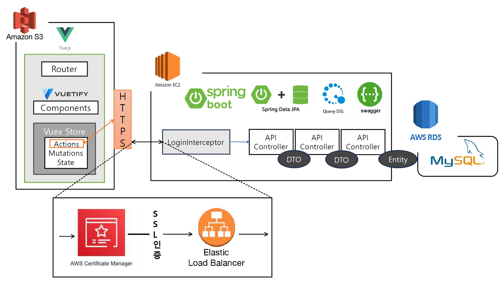
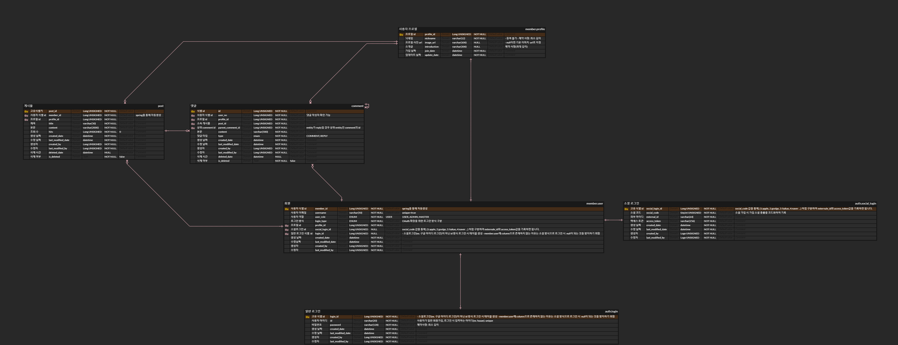
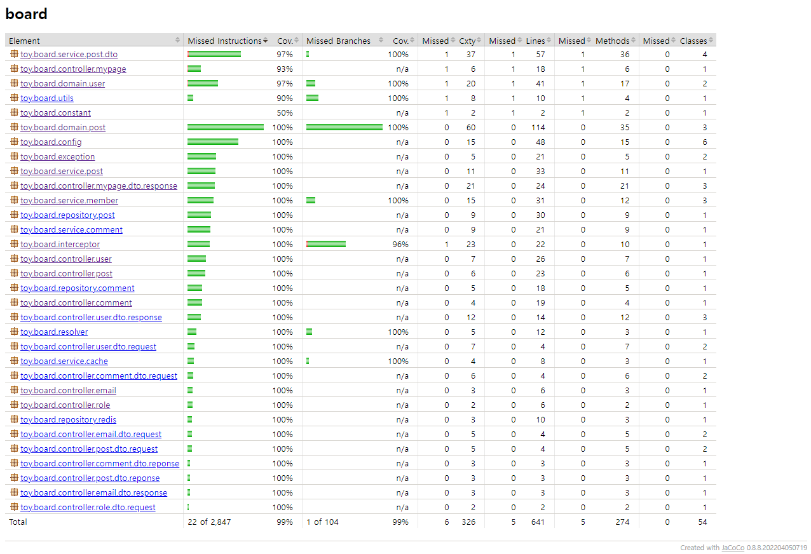

# My Board

**🔗  Links**

**CV** 

[백엔드 개발자, 김민규입니다.](https://www.notion.so/5d1232b5b33a48c3aca6d2020d4f640a?pvs=21)

**Frontend Github**

https://github.com/Haaae/web-board-front

**Web**

Websit | [https://myboard.site/](https://myboard.site/)

API docs | [https://api.myboard.site/swagger-ui/index.html](https://api.myboard.site/swagger-ui/index.html)

# 프로젝트 구조

### Spring boot를 이용한 BackEnd 구성

- Spring Session을 이용한 사용자 인증 및 관리
- JPA, Spring Data JPA, QueryDSL을 이용한 ORM 구성
- Swaager를 이용한 API 문서화

### Vue.js Framwork를 이용한 FrontEnd 구성

- Vuetify를 이용한 Component 구성
- Vuex를 이용한 상태 관리

### AWS 서비스를 이용한 각 모듈 배포

- BackEnd: **AWS EC2**
- FrontEnd: **AWS S3**
- DB: **AWS RDS**

# ERD

# 개발 상세

## 1. 계층형 테이블 구조를 적용하여 동일 엔티티 간 그래프 사용

- **이슈**

댓글과 답글을 `Comment`라는 하나의 엔티티로 나타낼 때 `bundle_id` 와 같이 별도의 값이 댓글과 답글 간 계층성을 표현하는 것은 댓글이 답글 리스트를 필드 멤버로 가지지 않으므로 엔티티를 객체지향적으로 다룰 수 없다는 문제점이 있다고 판단했습니다. 

추후 객체지향적 사용이 불가피해 수정이 이루어질 경우 코드뿐만 아니라 그 여파가 DB까지 전파되기 때문입니다.

- **해결 방안**

`Comment` 엔티티가 `parent` 라는 컬럼에 다른 `Comment` 엔티티의 PK값을 갖도록 합니다. 

이때 답글에 해당하는 엔티티는 자신이 계층적으로 포함된 댓글 인덱스를 PK값으로 갖고, 댓글은 `null`값을 갖습니다. 코드 레벨에서 `Comment` 클래스가 `@OneToMany` 매핑을 통해 답글 리스트를 필드 멤버로 갖도록 합니다. 

이로 하여금 `Comment` 관련 쿼리 작성 시 `fetch join`을 통해 댓글 엔티티와 연관된 답글 엔티티를 간편하게 불러오게 되고, 엔티티 그래프를 사용한 객체지향적인 코드 작성이 가능해집니다. 

- **해결 과정**

객체지향적 코드 작성을 위해서 `Comment` 클래스가 답글 리스트를 필드 멤버로 매핑하는 것이 필수라고 생각하여 `Comment` 엔티티가 스스로의 PK값을 컬럼값으로 갖는다는 결론을 내렸습니다.

이후 인프런 질문을 통해 결론을 검증했고, 그 과정에서 해당 방식의 테이블 구조가 계층형 테이블 구조라는 것을 알게 되었습니다.

- **결론**

항상 엔티티를 객체지향적으로 다루는 것을 고민해야 합니다. 그로 인한 trade off가 무엇인지도 함께 생각해봅니다.

서비스 개발에 DB 관련 지식이 중요함을 인지해야 합니다. 다양한 서비스를 알맞게 제공하려면 프로그래밍 언어와 DB 같은 기본적인 지식이 핵심이며 밑바당되어 있어야 합니다. 그에 대한 지식은 방대하므로 지속적으로 학습해야 합니다.  

## 2. Fetch Join을 사용한 엔티티 전체 조회 쿼리의 필터링과 페이징

- **이슈**

게시물 리스트를 보여주는 기능을 위해 `@OneToMany` 관계의 `Post` - `Comment` 엔티티를 DB에서 불러오는 과정에서 1+N 문제를 막기 위해 `fetch join`을 사용하니 오류가 발생했습니다.

- **원인 분석**

JPA에서 `~ToMany` 관계의 엔티티를  `fetch join`함과 동시에 페이징할 수 없습니다.

이는 `~ToMany` 관계의 엔티티를 조인한 테이블 row 수가 기준이 되는 엔티티 테이블의 row 수보다 많을 수 있기 때문입니다. 이때 페이징 한다면 데이터의 중복이 발생할 수 있습니다.

따라서 JPA에서는 페이징 하면서 컬렉션 관계를 `fetch join` 하는 것 자체를 동작하지 않도록 막아두었습니다. 그러므로 `distinct`를 적용하는 방법도 사용할 수 없습니다.

만일 하이버네이트를 통해 `fetch join`을 적용하더라도 경고 로그를 남기면서 모든 데이터를 메모리에 불러와서 페이징을 적용합니다. 메모리 관련 이슈가 발생할 수 있으므로 매우 위험합니다.

- **해결 방안**

해당 이슈를 해결하기 위한 방안은 `default_batch_fetch_size`를 사용하는 것입니다. 해당 옵션은 하위 엔티티를 지연로딩할때 한번에 상위 엔티티 ID를 지정한 숫자만큼 `in Query`로 로딩합니다. 이때 `Post` 엔티티만 페이징 조회하고, `Page.map()`을 통해 DTO로 변환하는 과정에서 컬렉션에 접근하여 `Comment` 엔티티들을 지연로딩합니다.

`default_batch_fetch_size` 의 장점으로,

1. 엔티티 그래프를 사용할 수 있습니다.
2. 그렇기 때문에 `Projection`을 사용한 해결 방식보다 코드 수정이 비교적 수월합니다.

단점으로,

1. `left join` + `Projection` 방식에 비해 쿼리의 수가 많아질 수 있습니다.
2. 더는 단방향 매핑 관계를 유지할 수 없어져 엔티티 매핑 관리 난이도가 상승합니다.

해당 이슈를 해결하는 다른 방안은 `left outer join`과 `Projection`을 사용해 엔티티가 아닌 값을 조회한 후 바로 DTO로 가져오는 것입니다. 

이 방법의 장점은,

1. 일반 값으로 이루어진 DTO는 영속성 컨텍스트에서 관리되지 않으므로 데이터 일관성을 유지할 수 있습니다.

2. `fetch join`을 사용하지 않게 되어 페이징이 가능해지며, 페이징에 필요한 쿼리의 숫자가 2개로 고정됩니다.

하지만, 엔티티 그래프를 사용할 수 없고 그렇기에 수정이 비교적 어려워지는 단점이 있습니다.

- **결론**

JPA에서 `fetch join` 사용이 용이하지 않을 때는 `default_batch_fetch_size` 혹은 `join` + `Projection`를 사용하여 해결합니다. 객체를 객체답게 사용하려면 `default_batch_fetch_size` 방식을 사용합니다.

## 3. 계층형 엔티티 벌크 삭제 시 FK 무결성 조건을 충족 및 벌크 연산 최적화화

- **이슈**

게시물 삭제 시 해당 게시물의 모든 댓글 삭제 로직 수행 중 에러가 발생했습니다.

- **원인 분석**

계층형 테이블 구조로 설계된 `Comment` 엔티티를 삭제할 때 해당 엔티티의 PK를 FK로 갖는 다른 `Comment` 엔티티가 존재할 경우 무결성 조건을 침해합니다.

- **해결 방안**
1. `@OneToMany` 어노테이션의 `CascadeType.REMOVE` 혹은 `orphanRemoval=true` 옵션을 적용해 `Post` 엔티티만 삭제해도 하위 컬렉션의 엔티티가 삭제되도록 할 수 있습니다.
    
    → `Comment`가 계층형 테이블 구조이기 때문에 논리상 존재하지 않는 `reply 타입 Comment`의 하위 컬렉션에 대해 불필요한 조회 쿼리가 발생합니다. 즉 특정 게시물의 댓글 수가 `N`, 대댓글 수가 `M`일 때 `1+M`의 조회 쿼리가 발생하는 것입니다. 이러한 문제는 `Post` 엔티티 조회 시 하위 `Comment`를 `Fetch Join`하거나 `default_batch_fetch_size` 를 적용하는 것으로 해결할 수 있습니다.
    
    하지만 `CascadeType.REMOVE` 혹은 `orphanRemoval=true` 옵션으로 벌크 삭제 시 삭제 쿼리가 삭제하는 엔티티의 개수(`N+M`)만큼 발생하는 문제가 남아있었습니다.
    
2. 불필요한 조회쿼리 및 삭제쿼리를 방지하기 위해 `CommentRepository` 를 통해 직접 `Comment` 엔티티를 우선적으로 삭제하는 방법을 사용할 수 있습니다. 이때 `@Query`를 통해 커스텀 쿼리를 생성해 하나의 삭제 쿼리만 발생하도록 만듭니다. 이 경우 `Post` 엔티티 삭제 시 쿼리의 수는 `1(Post 조회) + 1(Reply 타입 Comment 벌크 삭제) + 1(Comment 타입 Comment 벌크 삭제)`로 고정됩니다. 
    
    주의해야 할 점은, 이러한 커스텀 벌크 연산은 영속성 컨텍스트를 거치지 않고 쿼리를 실행하기 때문에 삭제하는 엔티티가 영속성 컨텍스트에 존재하더라도 영속성 컨텍스트는 엔티티의 삭제 사실을 알 수가 없습니다. 때문에 벌크 연산 실행 시, 1차 캐시(영속성 컨텍스트)와 DB의 데이터 싱크를 맞추기 위해 `@Modifying` 어노테이션을 추가해주어야 합니다.
    
    논외로, 이미 `Select`하여 객체로 다루고 있는 엔티티 컬렉션을 삭제하는 경우에는 `deleteAllInBatch(Iterable<T> entities)` 메서드를 사용할 수도 있습니다.
    

- **결론**

JPA에서 지원하는 기능을 편리하다는 이유로 자세한 확인 없이 사용한다면 예상치 못한 성능 저하를 일으킬 수 있습니다. 특히 `Cascasde`나 `orphanRemoval`처럼 엔티티의 상태를 자동으로 처리해주는 기능은 사용에 주의해야 합니다.

- ******참고******

`orphanRemoval` 기능은 부모 엔티티의 컬렉션에서 제외되어 부모 엔티티를 참조하지 않는 자식 엔티티를 자동으로 삭제해주는 기능이지만, 개념적으로 부모를 제거하면 자식이 참조하는 정보가 사라지므로 부모를 삭제할 때 자식도 함께 삭제됩니다. 이것은 `CasecadeType.REMOVE`처럼 동작하지만, `orphanRemoval`의 경우 컬렉션에서 제외하기만 해도 삭제된다는 차이가 있습니다.

## 4. 라인, 분기점 테스트 커버리지 99% 달성

- 이슈

['토스'의 테스트 커버리지 100%](https://www.youtube.com/watch?v=jdlBu2vFv58&pp=ygUh7Yag7IqkIO2FjOyKpO2KuCDsu6TrsoTrpqzsp4AgMTAw)라는 영상을 보고, 부하 테스트 전 테스트 결과에 따른 코드 수정 시 안전을 보장하기 위해 단위 테스트 커버리지의 기준이 필요하다고 생각하게 되었습니다.

- **이슈 해결 과정**

가장 중요한 것은 테스트 커버리지 정도를 어느 정도로 유지할 것이냐,였습니다. 테스트 커버리지가 100%라면 더할 나위 없겠습니다만, 저는 단위 테스트는 코드를 읽기만 해도 결과를 알 수 있는 부분은 단위 테스트로 작성하지 않았기 때문에, 테스트 커버리지 100%를 달성하기 위해서는 제 기준에서 불필요한 코드의 작성이 필요했습니다. 따라서 테스트 커버리지 최소치를 90%로 설정했습니다. 

jacoco를 사용하여 테스트 커버리지를 측정했으며, gradle 설정을 통해 라인, 브랜치 테스트 커버리지가 90%를 넘지 않으면 빌드되지 않도록 설정했습니다. 세션 체크를 위한 인터셉터나 전역 에러 처리 클래스와 같이 테스트가 어렵거나 불필요한 패키지와 클래스 역시 gradle 설정을 통해 테스트에서 제외했습니다.

각 레이어별 테스트 전략은 다음과 같습니다.

`Controller` 레이어의 경우 테스트코드가 개발 중 잦게 실행되는 단위 테스트이였기 때문에, `TestRestTemplate`와 `MockMvc` 중에서 전체 서버를 실행하여 시나리오 단위의 테스트를 진행하는데 용이한 `TestRestTemplate`보다, 엔드포인트 하나의 테스트에 집중하는 `MockMvc`를 사용하였습니다. 각 테스트코드의 실행 중 테스트와 연관없는 데이터나 객체가 중간과정에 존재하는 경우 Mock 객체를 주입하여 해결했습니다. HTTP code는 물론 Response의 Body를 확인하여 원하는 값이 반환되는지까지 확인하도록 코드를 작성했습니다.

`Service` 레이어의 경우  `Spring Data Jpa`를 사용한 `Repository` 클래스에 의존합니다. `Spring Data Jpa`를 사용하는 `Repository`는 인터페이스를 통해 stub 객체를 만들기 번거롭기 때문에 Mock 객체를 주입하는 방식으로 Spring Project 전체를 실행하지 않도록 테스트코드를 작성했습니다.

`Repository` 레이어의 경우 `Spring Data Jpa`와 `QueryDsl`을 사용하여 가독성 높은 자바 코드로 이루어졌기 때문에 테스트코드를 작성하지 않아도 코드의 작동과정을 한눈에 알아볼 수 있으므로 테스트코드를 작성하지 않았습니다. 불필요한 테스트코드를 작성하는 것은 곧 불필요한 비용소모라고 생각했습니다.

`Entity` 레이어의 경우 영속성 컨텍스트에 의해 관리되지 않으면 순수 자바 코드라고 볼 수 있습니다. 따라서 Spring Project를 실행시키지 않아야 한다는 걱정 없이 엔티티의 여러 메서드에 대해 단위테스트를 작성할 수 있었습니다.

- **결론**

안전한 코드 수정을 보장하기 위해서 자체적인 테스트 커버리지의 최소치를 설정했습니다. 

jacoco를 활용함으로써 추후 CI/CD를 적용했을 때 테스트 결과에 따른 자동 빌드/빌드 실패 하도록 설정할 수 있게 되었습니다.

각 레이어의 특성에 따라 단위 테스트라는 목적에 부합토록 테스트코드를 작성하였습니다.

jacoco 결과 이미지 보기

[jacoco html zip](./resource/test-coverage.zip)

## 5. 세션쿠키 저장을 위한 Same-Site 문제 해결

- 이슈

웹 프론트엔드와 서버를 각각 AWS S3와 EC2를 사용해서 구축했으나 세션 쿠키가 웹 클라이언트에 저장이 되지 않는 문제가 발생했습니다.

- **원인 분석**

구글 Chrome은 `CSRF` 문제를 방지하기 위해 `SameSite` 기본 속성값이 `Lax`로 설정되어있기 때문입니다.

- **해결 방안**

통상적으로 알려진 해결방식은 두 가지입니다.

1. `SameSite=Nome` 옵션을 추가해 쿠키 설정을 모든 사이트에 허용합니다. 이때 `Secure=true`이 필수이므로 요청에 `HTTPS`가 적용해야 합니다.
2. 도메인과 서브도메인을 사용해 웹 클라이언트와 서버가 `SameSite` 통신이 되도록 만듭니다.

같은 서비스의 도메인이 다를 이유가 없으며, 사이트가 달라서 발생하는 문제의 본질을 해결해야 한다고 판단하여 후자의 방식으로 이슈를 해결했습니다.

- **결론**

특별한 이유가 없다면 연관된 웹 서비스의 도메인을 호스팅할 때는 서브 도메인을 사용하여 같은 사이트로 호스팅합니다.

AWS Certificate manager(ACM), Route53, Load Balancer  서비스를 사용해 SSL 인증서 발급받고 도메인을 호스팅할 수 있습니다. 

# 서비스 사용 예시

[서비스 사용 예시](https://www.notion.so/fff8fd2a808542448de5960766281d0d?pvs=21)
